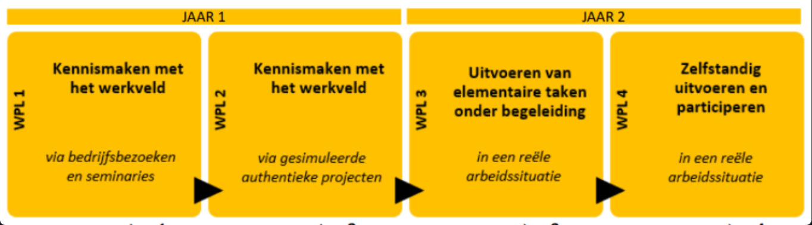

# Logboek werkplekleren

## Logboek WPL 1

Werkplekleren was een essentieel vak voor deze richting. Het interessante was wanneer gastsprekers over hun eigen werkervaringen vertelden. 
Het volgende is een logboek van opdrachten die gegeven zijn in WPL1.

POP: AIM-reflectie (Zelf-reflectie maken met gebruik van een sjabloon)
 
POP: Planning en zelfsturing (Eigen weekplanning opbouwen)
 
Talstels (Binair, hex, octaal)
 
Carrièrekompas (Een doel stellen en vacature bekijken van mogelijke toekomstige job in de richting van netwerkbeheer)
 
Computerbouwen (In groep bouwen van een computer, het documenteren ervan, en uiteindelijk een peer-evaluation)
 
Presentatie actualiteit (Presentatie in groep, elke groep krijgt een verschillende stelling in verband met IT en moet hun standpunt verklaren)
 
Netwerkdocumentatie (Opbouwen van een klein netwerk in Packet Tracer, correct configureren en documenteren van elke stap)

## Planning WPL 1

## Logboek WPL 2

zie Opdrachten en Reflectie