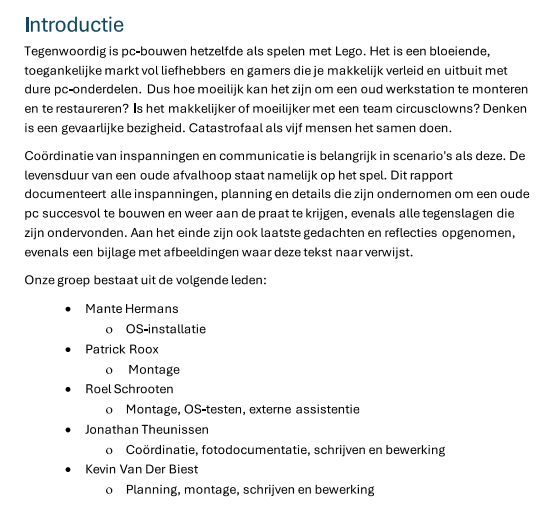

# Opdrachten

## Opdrachten WPL 1

WPL 1 opdrachten overzicht:
POP: AIM-reflectie (Zelf-reflectie maken met gebruik van een sjabloon)
POP: Planning en zelfsturing (Eigen weekplanning opbouwen)
Talstels (Binair, hex, octaal)
Carrièrekompas (Een doel stellen en vacature bekijken van mogelijke toekomstige job in de richting van netwerkbeheer)
Reflectie gastspreker Niels (CEO van een Belgisch cybersecurity-bedrijf)
Reflectie gastsprekers Turan en Peter (Netwerkbeheerders van PXL)
Computerbouwen (In groep bouwen van een computer, het documenteren ervan, en uiteindelijk een peer-evaluation)
Presentatie actualiteit (Presentatie in groep, elke groep krijgt een verschillende stelling in verband met IT en moet hun standpunt verklaren)
Netwerkdocumentatie (Opbouwen van een klein netwerk in Packet Tracer, correct configureren en documenteren van elke stap)

Ik had moeite met het carrièrekompas. Misschien was het omdat deze meer in het begin van het semester was maar ik vond moeilijk om deze opdracht af te werken. Buiten dit vond ik de andere opdrachten redelijk fijn.

Top 3 WPL-taken:

3: Computerbouwen
Ik heb heel wat van deze opdracht geleerd, ik heb veel meer ervaring met software dan met hardware dus was het fijn om voor de verandering te werken met pc-componenten in plaats van software. Het was ook de eerste keer dat ik een pc heb geassembleerd (in groep). 

2: Binaire, hexadecimale, octale talstelsels
Het was goed dat al vroeg in WPL1 geïntroduceerd werd, dit was heel nuttig voor een van de hoofdstukken van networks en ik heb het veel moeten gebruiken. Ik vond het ook fijn om te leren hoe deze waardes in elkaar zitten en hoe ze met elkaar corresponderen.

1: Reflectie gastsprekers Turan en Peter
Ik vond ze heel interessante gastsprekers. Vooral het deel waar ze een kleine tour deden van de serverroom was interessant. Het was ook interessant om te zien wat voor software ze gebruiken.

## Opdrachten WPL2

In Werkplekleren 2 hebben we een simulatie gehad van een arbeidssituatie die we op het echte werkveld zouden kunnen tegenkomen. Tijdens dit vak hebben we veel technische taken afgewerkt. 
Het volgende is een logboek van installaties en configuraties die ik heb afgewerkt tijdens WPL2.

### Sprint 1

- Opzetten dualboot PC Internethoek (T03_10_10) (Windows 11 + Ubuntu) + template
 
- Opzetten Windows 11 client PC + hier een template van maken
 
- Topologie maken van netwerkinfrastructuur voor WPL2 project (De Demer). Dit houdt in: de firewall, virtuele switches, klaslokalen, pc's en alle ip-addressen hiervan.
 

### Sprint 2

- Installatie van Active Directory en opzetten van domain op Windows Server 2022 (domain controller 1)
 
- Vaste IP addressering voor DC01
 
- Script maken voor het creëren van users in de active directory. Deze worden ook automatisch via het script ingedeeld in de OU structuur.
 
- Creëren van roaming profiles voor leerkrachten, secretariaatsmedewerkers en directie.
 
- Alle Windows client aanhangen aan het domein (dedemer.local)

### Sprint 3

- Ubuntu ICT PC aanhangen aan Active Directory (via realm)
 
- AGDLP toepassen op het domein.
 
- Installeren en configureren van SavaPage (printing software) voor alle users van het domein. Dit bevat ook persoonlijke bedragen voor elke user dia via LDAP geregistreerd is en een statisch bedrag voor het printen van documenten. 

### Sprint 4

- Aanmaken intranet-website "intranet.dedemer.be". Deze heeft Windows AD-authentication, is bereikbaar over de DNS naam en is bereikbaar over HTTPS.
 
- Instellen van homefolders voor elke user in de active directory. Deze homefolders hebben een hard quota waarbij alleen mp3 en mp4-bestanden geupload kunnen worden, er een datalimiet is van 100MB, en er een melding aan de user wordt gestuurd bij 90%+ opslaggebruik.
 
- Installatie en implementatie FOG-imaging solution. Deze is geinstalleerd op een aparte Ubuntu-server. Deze FOG-server stuurt een boot image "ipxe.efi" (voor UEFI clients) over het netwerk die clients fetchen over TFTP. 